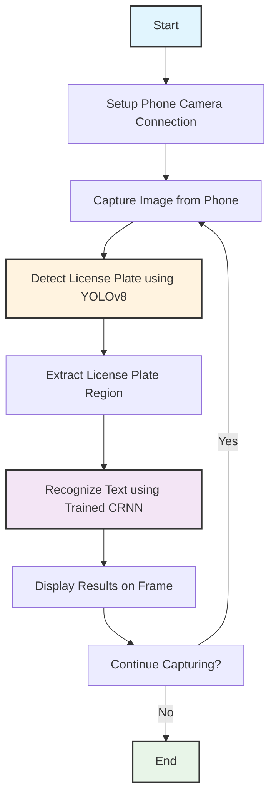

# Real-Time License Plate Detection and Recognition (YOLOv8 + CRNN)

## Overview

This project is a complete, end-to-end system for real-time Automatic Number Plate Recognition (ANPR). It leverages a state-of-the-art **YOLOv8** model for robustly detecting license plates in a video stream and a **Convolutional Recurrent Neural Network (CRNN)** built with PyTorch for accurately recognizing the alphanumeric characters. The system is designed for practical use, processing a live video feed directly from a smartphone's IP camera.

## Key Features

-   **High-Accuracy Detection:** Employs a custom-trained **YOLOv8 model** to locate license plates in varied conditions, significantly outperforming traditional methods.
-   **Robust Text Recognition:** Utilizes a **CRNN with PyTorch** to accurately read alphanumeric characters in sequence.
-   **Real-Time Performance:** Processes a live video stream from a smartphone camera via an IP Webcam connection.
-   **End-to-End Pipeline:** Includes complete, commented Python scripts for data preprocessing, detector training, recognizer training, evaluation, and deployment.
-   **Data Augmentation:** The CRNN training script includes data augmentation to build a more robust recognition model that is resilient to variations in lighting, angle, and scale.

## Project Flow (Real-Time Detection)

The core logic of the real-time detection and recognition process is illustrated below:



## Technology Stack

-   **Backend:** Python 3.10+
-   **Object Detection:** YOLOv8 (Ultralytics)
-   **Text Recognition:** PyTorch
-   **Image Processing:** OpenCV, Pillow
-   **Data Handling:** Pandas, NumPy, PyYAML
-   **Utilities:** tqdm, scikit-learn

## Project Structure

```
license_plate_recognition/
|
|-- data/
|   |-- train/                # All training images (full car photos)
|   |-- test/                 # All test images for final prediction
|   |-- yolo_dataset/         # Auto-generated by train_detector.py
|
|-- models/                   # Stores the trained CRNN model
|
|-- runs/                     # Auto-generated by train_detector.py, stores YOLO model
|
|-- licplatesdetection_train.csv
|-- licplatesrecognition_train.csv
|-- SampleSubmission.csv
|
|-- main.py                 # Main script for real-time detection
|-- train.py                # Script to train the CRNN text recognizer
|-- train_detector.py       # Script to train the YOLOv8 license plate detector
|-- detect.py               # Contains the detection & recognition logic for a single frame
|-- predict_test.py         # Generates the submission file for the test set
|-- evaluate.py             # Evaluates the model accuracy on the training set
|-- requirements.txt        # Project dependencies
|-- README.md               # This file
```

## Setup & Installation

#### 1. Clone or Download the Repository
Get all the project files onto your local machine.

#### 2. Set Up Data Folders
-   Place all your full training images (e.g., `1.jpg`, `2.jpg`) inside the `data/train/` folder.
-   Place all your test images (e.g., `901.jpg`, `902.jpg`) inside the `data/test/` folder.
-   Ensure the `.csv` files are in the root project directory.

#### 3. Create a Virtual Environment & Install Dependencies
It is highly recommended to use a virtual environment to avoid package conflicts.

```bash
# Create and activate a virtual environment
python -m venv venv
# On Windows:
# venv\Scripts\activate
# On macOS/Linux:
# source venv/bin/activate

# Install all required packages
pip install -r requirements.txt
```

## Usage: Step-by-Step Guide

Follow these steps in order to train the models and run the application.

### Step 1: Train the YOLOv8 Detector
This script will prepare your detection data and train the YOLOv8 model to find license plates. This can take a significant amount of time, especially without a GPU.

```bash
python train_detector.py
```
-   **Output:** This will create a `runs/detect/yolov8_license_plate_detector/` folder. Inside, the best-performing model will be saved as `weights/best.pt`.
-   **Action:** Verify that the `YOLO_MODEL_PATH` in `detect.py` and `predict_test.py` matches this output path.

### Step 2: Train the CRNN Recognizer
This script trains the model to read the characters from the license plates.

```bash
python train.py
```
-   **Output:** This will create a file named `models/crnn_augmented.pth`. This is your trained text recognition model.

### Step 3: Run Real-Time Detection
1.  **On Your Phone:** Connect to Wi-Fi (or use a hotspot) and start the "IP Webcam" app. Note the IPv4 URL it provides.
2.  **On Your Computer:** Connect to the same network. Open `main.py` and update the `url` variable with the one from your phone, adding `/video` at the end (e.g., `url = "http://192.168.1.10:8080/video"`).
3.  **Run the script:**
    ```bash
    python main.py
    ```
    A window will appear showing your phone's camera feed. Point it at a license plate to see the detection and recognition in action! Press 'q' to quit.

### Step 4: Generate Predictions for the Test Set
To create the final submission file based on the images in `data/test/`, run:

```bash
python predict_test.py
```
-   **Output:** A file named `submission_yolo.csv` will be created in the root directory, populated with the model's predictions in the required format.